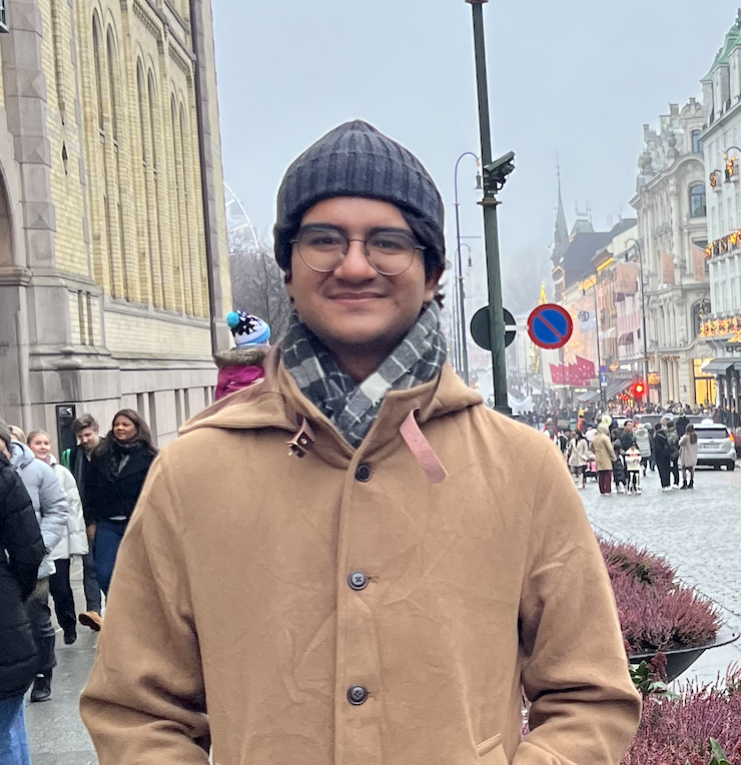
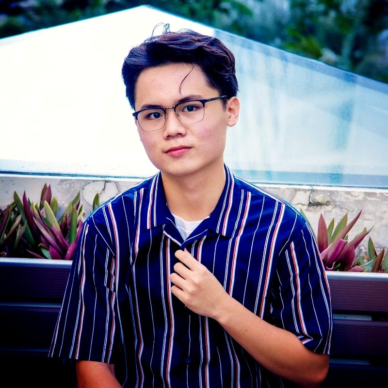

# About Us

We are a team based in the [School of Computing, National University of Singapore](http://www.comp.nus.edu.sg).

You can reach us at the email `seer[at]comp.nus.edu.sg`

## Project team

### Vishesh Gauhar

[[github](https://github.com/GauhVish)]
[[portfolio](team/johndoe.md)]

* Role: Project Member
* Responsibilities: Documentation

### Harish S/O Balamurugan

[[github](http://github.com/HarishB99)]
[[portfolio](team/harishb99.md)]

* Role: Testing
* Responsibilities: Ensure testing is done on time and meets minimum requirements

### Ho Chi Thanh

[[github](http://github.com/ho-thanh-und)] [[portfolio](team/johndoe.md)]

* Role: Project Member
* Responsibilities: Testing

### Tam Cheng Yong Enzo

[[github](http://github.com/zonnie-23)]
[[portfolio](team/johndoe.md)]

* Role: Project Member
* Responsibilities: Scheduling and tracking

### Tram Minh Man

[[github](http://github.com/DanielJames0302)]
[[portfolio](team/johndoe.md)]

* Role: Developer
* Responsibilities: Model
