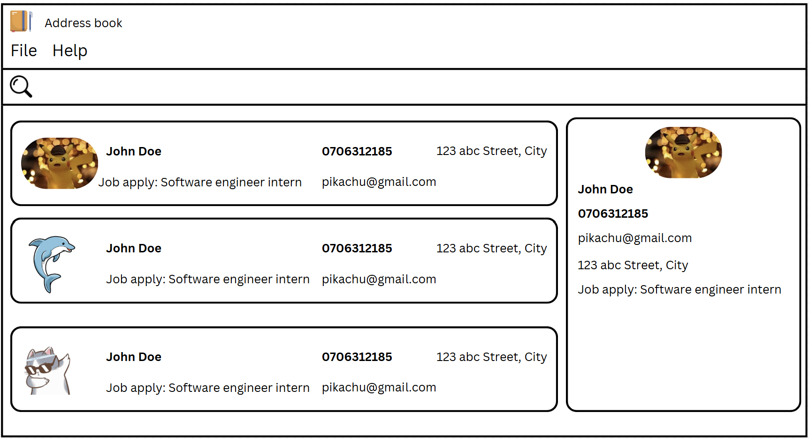
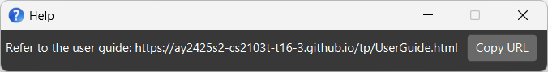

# ***QuickHire*** User Guide

***QuickHire*** is a desktop address book application designed for recruiters to manage and organise the details of their potential job candidates.

<!-- * Table of Contents -->
<page-nav-print />

--------------------------------------------------------------------------------------------------------------------

## Quick start

1. Ensure you have Java `17` or above installed in your Computer. 
   **Mac users:** Ensure you have the precise JDK version prescribed [here](https://se-education.org/guides/tutorials/javaInstallationMac.html).

1. Download the latest `.jar` file from [here](https://github.com/AY2425S2-CS2103T-T16-3/tp/releases).

1. Copy the file to the folder you want to use as the _home folder_ for your ***QuickHire*** application.

1. Open a command terminal, `cd` into the folder you put the jar file in, and use the `java -jar quickhire.jar` command to run the application. 
   A GUI similar to the below should appear in a few seconds. Note how the app contains some sample data. 
   

1. Type the command in the command box and press Enter to execute it. e.g. typing **`help`** and pressing Enter will open the help window. 
   Some example commands you can try:

   * `list` : Lists all contacts.

   * `add n/John Doe p/98765432 e/johnd@example.com a/John street, block 123, #01-01 j/Software Engineer l/Unreviewed` : Adds a contact named `John Doe` to the Address Book.

   * `delete 3` : Deletes the 3rd contact shown in the current list.

   * `clear` : Deletes all contacts.

   * `exit` : Exits the app.

1. Refer to the [General command format](#general-command-format) below for details of each command.

<a href="#quickhire-user-guide" class="ug-nav-top">[Go to top]</a>

--------------------------------------------------------------------------------------------------------------------

## General command format

<box type="info" seamless>

**Notes about the command format:** 

* Words in `UPPER_CASE` are the parameters to be supplied by the user. 
  e.g. in `add n/NAME`, `NAME` is a parameter which can be used as `add n/John Doe`.

* Items in square brackets are optional. 
  e.g `n/NAME [t/TAG]` can be used as `n/John Doe t/friend` or as `n/John Doe`.

* Items with `…`​ after them can be used multiple times including zero times. 
  e.g. `[t/TAG]…​` can be used as ` ` (i.e. 0 times), `t/friend`, `t/friend t/family` etc.

* Some commands have items **starting with** `/` (e.g., `/a`, `/f`, etc.). They are to be specified as they are without any parameters.
  e.g. `save c/candidates.json /f`

* Parameters can be in any order. 
  e.g. if the command specifies `n/NAME p/PHONE_NUMBER`, `p/PHONE_NUMBER n/NAME` is also acceptable.

* Extraneous parameters for commands that do not take in parameters (such as `help`, `list`, `exit` and `clear`) will be ignored. 
  e.g. if the command specifies `help 123`, it will be interpreted as `help`.

* If you are using a PDF version of this document, be careful when copying and pasting commands that span multiple lines as space characters surrounding line-breaks may be omitted when copied over to the application.
</box>

<a href="#quickhire-user-guide" class="ug-nav-top">[Go to top]</a>

## Viewing help : `help`

Shows a message explaining how to access the help page.

Format: `help`

<a href="#quickhire-user-guide" class="ug-nav-top">[Go to top]</a>

## Commands for person data
### Adding a person: `add`

Adds a person to the address book.

Format: `add n/NAME p/PHONE_NUMBER e/EMAIL a/ADDRESS j/JOB ROLE l/LABEL [s/INTERVIEW_SCHEDULE] [r/REMARK] [t/TAG]…​`

<box type="tip" header="**Tip**">

A label can only be Unreviewed, Shortlisted, Rejected or Accepted. 
A person can have any number of tags (including 0)

</box>

<box type="info" seamless>

For `j/JOB ROLE` field, the `JOB ROLE` added has to match one that already exists in the saved list. 
To find this saved list, use `listJ`

Refer to [this](#commands-for-managing-saved-list-of-job-roles) for more info.

</box>

Examples:
* `add n/John Doe p/98765432 e/johnd@example.com a/311, Clementi Ave 2, #02-25 j/Data Scientist l/Unreviewed r/Likes to code t/friends t/owesMoney`
* `add n/Vish p/1293123 e/sample@domain.com a/213123 street j/ProData guy l/Rejected`

<a href="#quickhire-user-guide" class="ug-nav-top">[Go to top]</a>

### Listing all persons : `list`

Shows a list of all persons in the address book.

<box type="tip" header="**Tip**">

By default, only basic contact details are displayed.
To view full contact details of the candidate, use the `view` command.

</box>

Format: `list`

<a href="#quickhire-user-guide" class="ug-nav-top">[Go to top]</a>

### Editing a person : `edit`

Edits an existing person in the address book.

Format: `edit INDEX [n/NAME] [p/PHONE] [e/EMAIL] [a/ADDRESS] [j/JOB ROLE] [l/LABEL] [s/INTERVIEW_SCHEDULE] [r/REMARK] [t/TAG]…​`

* Edits the person at the specified `INDEX`. The index refers to the index number shown in the displayed person list. The index **must be a positive integer** 1, 2, 3, …​
* At least one of the optional fields must be provided.
* Existing values will be updated to the input values.
* When editing tags, the existing tags of the person will be removed i.e adding of tags is not cumulative.
* You can remove all the person’s tags by typing `t/` without specifying any tags after it.
* You can remove a person’s remarks by typing `r/` without specifying any remarks after it.
* You can remove a person’s interview schedule by typing `s/` without specifying any date time after it.
* **Note**: When you edit a candidate’s name or email, their interview schedules will be updated automatically with the new information.
Examples:
*  `edit 1 p/91234567 e/johndoe@example.com s/10-02-2025 9:00` Edits the phone number, email address and interview schedule of the 1st person to be `91234567`, `johndoe@example.com`, `10-02-2025 9:00` respectively.
*  `edit 2 n/Betsy Crower t/` Edits the name of the 2nd person to be `Betsy Crower` and clears all existing tags.
*  `edit 1 r/` Clears all remarks for the 1st person.
*  `edit 1 l/Shortlisted` Updates the label of the 1st person to `Shortlisted`.

<a href="#quickhire-user-guide" class="ug-nav-top">[Go to top]</a>

### Viewing a person's full application details: `view`

Displays the full details of selected candidate.

<box type="tip" header="**Tip**">

The application will show the full details of the first candidate in the list on startup, if any. 

</box>

Format: `view INDEX`

* Additional details about candidate shown include personal contact number and address.

Example:
* `view 1` Displays the full information of the first person in the side panel.

<a href="#quickhire-user-guide" class="ug-nav-top">[Go to top]</a>

### Locating persons by name: `find`

Finds persons whose details contain any of the given keywords.

Format: `find KEYWORD [MORE_KEYWORDS]`

* The search is case-insensitive. e.g `hans` will match `Hans`
* The order of the keywords does not matter. e.g. `Hans Bo` will match `Bo Hans`
* All details of a person are searched.
* Only full words will be matched. e.g. `Han` will not match `Hans`
* Persons whose details match at least one of the keyword(s) provided will be returned. The details of a person that will be searched for are as follows:
  * Name
  * Phone number
  * Email address
  * Address
  * Job Roles applied for
  * Label given to the person
  * Remarks provided for the person
  * Tags associated with the person
   
  
  e.g. `Hans Bo` will return `Hans Gruber`, `Bo Yang`

Examples:
* `find John` Returns `john` and `John Doe`.
* `find alex david` Returns `Alex Yeoh`, `David Li`. 
  

<a href="#quickhire-user-guide" class="ug-nav-top">[Go to top]</a>

### Deleting a person : `delete`

Deletes the specified candidate from the candidate list.

Format: `delete INDEX`

* Deletes the candidate at the specified `INDEX`.
* The index refers to the index number shown in the displayed candidate list.
* The index **must be a positive integer** 1, 2, 3, …​
* **Note**: Deleting a candidate won’t remove their interview schedules. We keep those schedules for record‑keeping so you can review past interviews. 
* If you do need to delete them, use the sdelete command shown below.
Examples:
* `list` followed by `delete 2` deletes the 2nd candidate in the address book.
* `find Betsy` followed by `delete 1` deletes the 1st candidate in the results of the `find` command.

<a href="#quickhire-user-guide" class="ug-nav-top">[Go to top]</a>

### Clearing all entries : `clear`

Clears all entries from the address book.

Format: `clear`

<a href="#quickhire-user-guide" class="ug-nav-top">[Go to top]</a>

### Adding remarks to a person : `remark`

Note: The functionalities of this command can be achieved via the `r/REMARK` flag in `add` and `edit` commands.

Format: `remark INDEX r/REMARK`

* Adds a remark to the person at the specified `INDEX`. The index refers to the index number shown in the displayed person list. The index **must be a positive integer** 1, 2, 3, …​
* Existing values will be updated to the input values.
* You can remove a person’s remarks by typing `r/` without specifying any remarks after it.

Examples:
*  `remark 1 r/Likes to code` Adds a remark (`Likes to code`) to the 1st person
*  `remark 1 r/` Clears all remarks for the 1st person

<a href="#quickhire-user-guide" class="ug-nav-top">[Go to top]</a>

## Commands for interview schedules

<box type="tip" header="**Tip**">

Commands used for managing interview schedules start with `s`.

</box>

### Adding an interview schedule: `sadd`

Adds an interview schedule of a candidate to the interview schedule board.

Format: `sadd c/INDEX s/INTERVIEW_DATE_AND_DURATION m/MODE`

<box type="tip" header="**Tip**">

A mode can only be Online, or Offline. 

</box>

* Adds the interview schedule of candidate specified at the `INDEX`. The index refers to the index number shown in the displayed candidate list. The index **must be a positive integer** 1, 2, 3, …​
* `INTERVIEW_DATE_AND_DURATION`: Interview schedule for candidates
  - Format: `yyyy-MM-dd HH:mm HH:mm`
    - `yyyy-MM-dd`: date of the interview
    - First `HH:mm` = start time
    - Second `HH:mm` = end time
  - Both start time and end time must fall on the same calendar day.
  - Duration must be at least 15 minutes and no more than 4 hours.
  - You may schedule interviews in the distant past or future—just as Google Calendar allows—to support record‑keeping and planning. The past schedules will be displayed in a lighter color in the schedule board.
  - To schedule across midnight, split into two commands (one per day).
* `MODE`: Format of the interview
  - Either Online or Offline.
  
* All fields must be provided.

Examples:
* `sadd c/2 s/2025-03-15 15:00 16:00 m/online`
* `sadd c/1 s/2025-05-05 9:00 10:00 m/offline`

### Listing all interview schedules : `slist`

Shows a list of all interview schedules in the interview schedule board.

Format: `slist`

### Editing an interview schedule : `sedit`

Edits an existing interview schedule in the interview schedule board.

Format: `sedit SCHEDULE_INDEX [s/INTERVIEW_DATE_AND_DURATION] [m/MODE]`

* Edits the schedule at the specified `SCHEDULE_INDEX`. The schedule index refers to the index number shown in the displayed schedule board. The schedule index **must be a positive integer** 1, 2, 3, …​
* `INTERVIEW_DATE_AND_DURATION`: Interview schedule for candidates
   - Format: `yyyy-MM-dd HH:mm HH:mm`
      - `yyyy-MM-dd`: date of the interview
      - First `HH:mm` = start time
      - Second `HH:mm` = end time
   - Both start time and end time must fall on the same calendar day.
   - Duration must be at least 15 minutes and no more than 4 hours.
   - You may schedule interviews in the distant past or future—just as Google Calendar allows—to support record‑keeping and planning. The past schedules will be displayed in a lighter color in the schedule board.
   - To schedule across midnight, split into two commands (one per day).
* `MODE`: Format of the interview
   - Either Online or Offline.
* At least one of the optional fields must be provided.
* Existing values will be updated to the input values.

Examples:
*  `sedit 1 s/2025-05-22 15:00 17:00 m/offline` Edits the date and duration, and interview mode of the 1st schedule to be `2025-05-22 15:00 17:00`, `offline` respectively.
*  `sedit 2 s/2025-05-25 14:00 15:00` Edits the date and duration of the 2nd schedule to be `2025-05-25 14:00 15:00`.
*  `sedit 1 m/online` Edits the mode of the 1st schedule to be `online`.

### Deleting an interview schedule: `sdelete`

Deletes the specified interview schedule from the interview schedule board.

Format: `sdelete SCHEDULE_INDEX`

* Deletes the interview schedule at the specified `SCHEDULE_INDEX`.
* The schedule index refers to the index number shown in the displayed schedule board.
* The schedule index **must be a positive integer** 1, 2, 3, …​

Examples:
* `slist` followed by `sdelete 2` deletes the 2nd schedule in the schedule board.

### Clearing all interview schedules: `sclear`

Clears all interview schedules from the schedule board.

Format: `sclear`

## Commands for managing saved list of job roles 

<box type="info" seamless>

The `j/JOB ROLE` can only take in certain job roles, which must match job roles in the saved list of job roles. This list is can be configured and saved locally.

By default, when starting up the application for the first time, there are 9 job roles preloaded.

`Back End Developer`, `Data Scientist`, `DevOps Engineer`, `Front End Developer`, `IT Administrator`, `Product Manager`, `QA Engineer`, `Software Engineer`, `UI Designer`

These commands are to modify the saved list of job roles. Available actions include to add, delete and list all job roles.

</box>

### Adding a job role : `addJ`

Adds a job role to the list of saved job roles.

Format: `addJ JOB ROLE`

Examples:
* `addJ Software Engineering Intern`
* `addJ Software Tester`

### Deleting a job role: `deleteJ`

Deletes a job role from the list of saved job roles.

Format: `deleteJ JOB ROLE`

Examples:
* `deleteJ Software Engineering Intern`
* `deleteJ Software Tester`

### List all saved job role: `listJ`

List all saved job roles that can be added to any candidates

Format: `listJ`

## Saving the data : `save`

Changes to data (pertaining to candidates and interview schedules) are automatically saved by ***QuickHire*** (see [Editing the data file](#editing-the-data-file)).
However, users can choose to save this data to a separate file of their choice (i.e., by using this command).

<box type="tip">

The application needs to have sufficient permissions to write to the file(s) specified in order for the `save` feature to work.

</box>

Format: `save [c/FILE_TO_SAVE_CANDIDATES] [s/FILE_TO_SAVE_INTERVIEW_SCHEDULES] [/a] [/f]`

* Saves data pertaining to candidates into the file referred by `FILE_TO_SAVE_CANDIDATES`
* Saves data pertaining to interview schedules into the file referred by `FILE_TO_SAVE_INTERVIEW_SCHEDULES`
* At least one of `[c/FILE_TO_SAVE_CANDIDATES]` or `[s/FILE_TO_SAVE_INTERVIEW_SCHEDULES]` must be specified. It is also okay to specify both.
* By default, if a filter was applied to the data (e.g., using `find`), then _only the filtered data_ will be saved.
* (Optional) Specify `/a` to save all ***QuickHire*** data (instead of just the filtered ones).
* By default, if the file(s) specified already exists, then no data will be overwritten to those file(s).
* (Optional) Specify `/f` to overwrite the contents of the file specified

Examples:
* `save c/past_candidates.json` Saves the filtered data of candidates to `[JAR file location]/past_candidates.json` (if it does not exist).
* `save /a c//all_candidates.json` Saves the data of all candidates in the application to `/all_candidates.json` (Note the additional `/` after `c/`).
* `save c/existing_file.json /a /f` Saves the data of all candidates in the application to `[JAR file location]/exiting_file.json` and overwrites any existing data in the file.
* `save s/interview_schedule.json` Saves the (filtered) interview schedules to `[JAR file location]/interview_schedule.json` (if it does not exist).
* `save c/candidates_details.json s/interview_details.json` Saves the filtered data of candidates and (filtered) interview schedules to `[JAR file location]/past_candidates.json` and `[JAR file location]/interview_schedule.json` respectively (if they do not exist).

<a href="#quickhire-user-guide" class="ug-nav-top">[Go to top]</a>

## Viewing job application statistics: 'viewstats'

Displays the number of applications for each job role.

Format: `viewstats`

<a href="#quickhire-user-guide" class="ug-nav-top">[Go to top]</a>

## Changing the theme : `theme`

Changes the theme of the UI.

Format: `theme dark/light`

* You may change the theme using the above command or the GUI.
* Your theme will be saved the next time you re-open the application as well.

<a href="#quickhire-user-guide" class="ug-nav-top">[Go to top]</a>

## Exiting the program : `exit`

Exits the program.

Format: `exit`

<a href="#quickhire-user-guide" class="ug-nav-top">[Go to top]</a>

## Editing the data file

Data pertaining to candidates and interview schedules are saved automatically into two JSON files: `[JAR file location]/data/candidates_list.json` and `[JAR file location]/data/scheduleboard.json` respectively.
Advanced users are welcome to update these data directly by editing those data files.

<box type="warning">

**Caution:**

If your changes to the data files makes their format invalid (e.g. having duplicates or invalid data format), ***QuickHire*** will discard all data and start with empty data files at the next run.  Hence, it is recommended to take a backup of the files before editing it.
This can be done by either copying the two files mentioned, or by using the `save` command (See [Saving the data : `save`](#saving-the-data--save)). 

Furthermore, certain edits can cause ***QuickHire*** to behave in unexpected ways (e.g., if a value entered is outside the acceptable range).
Therefore, edit the data files only if you are confident that you can update it correctly.

</box>

<a href="#quickhire-user-guide" class="ug-nav-top">[Go to top]</a>

## Archiving data files `[coming in v2.0]`

Allows for the automatic _backup_ of data.

_Details coming soon ..._

## Searching for interview schedule `[coming in v2.0]`

Provides a way to lookup interview schedules by date and/or time.

_Details coming soon ..._

## Importing data files `[coming in v2.0]`

Allows for importing data files into the app.

_Details coming soon ..._

## Sorting data displayed in the app `[coming in v2.0]`

Allows for the sorting of data that is displayed in the app.

_Details coming soon ..._

<a href="#quickhire-user-guide" class="ug-nav-top">[Go to top]</a>

--------------------------------------------------------------------------------------------------------------------

## FAQ

**Q**: What if the same person applies to the same company a few months later? 
**A**: There are 2 options:
1. Edit the person's existing entry with the updated details; or
1. Delete the old entry, and re-add the complete and updated details of the person (should there be any clashes in data)

**Q**: What if the person wants to apply for multiple roles within the same company?  
**A**: Multiple job roles can be added using the edit command.

**Q**: I have details of 37 candidates saved in the app. But when I run `save`, the file only has details of 2 candidates. Why is this so?  
**A**: Probably the `save` command was executed without any optional flags. To be able to save all data, you have 2 options:
1. (Easiest) Use the optional `/a` flag of `save` command to save all candidates' information. 
   E.g., `save c/file_to_save.json /a`
1. Run `list` in the app to ensure the app no filtered is applied to the candidates' data. Then run the `save` command as usual.

**Q**: I want to save the data of candidates and interview schedules. I want to overwrite any existing data I have of candidates, but I don't want to overwrite any existing data pertaining to interview schedules. What should I do?  
**A**: Save both data separately using two commands (instead of one) like so:
1. Save **only** the data of candidates first, specifying the `/f` flag to overwrite any existing data. 
   E.g., `save c/candidates_as_of_24_July.json /f`
1. Then, save the data on interview schedules separately, but **without** the `/f` flag. 
   E.g., `save s/interview_schedules`

**Q**: I have saved some data of potential candidates in a JSON file and I would like to import it into the application. What should I do? 
**A**: As of `v1.5.1`, ***QuickHire*** doesn't support importing data files from within the application. However, there is a workaround. To import the data, perform the following steps:
1. (Optional, but recommended) Make a copy of the data file you have (so that you have a backup copy in case the data gets corrupted).
1. Close ***QuickHire***.
1. Rename the file you wish to import as either `[JAR file location]/data/candidates_list.json` or `[JAR file location]/data/scheduleboard.json`. 
   In this case, you want to rename it as `[JAR file location]/data/candidates_list.json` since you are importing data of potential candidates.
1. Launch ***QuickHire*** again. If everything went well, you should be able to view the data from the file you imported in the application. 

**Q**: The `slist` command seems not working? 
**A**: In QuickHire v1.6, the slist command doesn’t affect the interview schedule display because search and sort features haven’t been implemented yet. Once those capabilities are added, you’ll see the schedule board updated.
For now, if you navigate back to the original, unfiltered schedule board—which shows every entry—you can run `slist` there. Although you won’t notice any change until the search/sort functions arrive, that’s where the command will take effect.
<box type="warning">
   
**Caution**

Note that when you import data this way, you will only see the data from the newly imported file, and ***the data from the old file will be removed***.
If you wish to keep the old data file as well, create a separate backup of it (as mentioned under [Editing the data file](#editing-the-data-file)).

</box>

<a href="#quickhire-user-guide" class="ug-nav-top">[Go to top]</a>

--------------------------------------------------------------------------------------------------------------------

## Known issues

1. **When using multiple screens**, if you move the application to a secondary screen, and later switch to using only the primary screen, the GUI will open off-screen. The remedy is to delete the `preferences.json` file created by the application before running the application again.
1. **If you minimize the Help Window** and then run the `help` command (or use the `Help` menu, or the keyboard shortcut `F1`) again, the original Help Window will remain minimized, and no new Help Window will appear. The remedy is to manually restore the minimized Help Window.

<a href="#quickhire-user-guide" class="ug-nav-top">[Go to top]</a>

--------------------------------------------------------------------------------------------------------------------

## Flags summary

| Action | Description                           | Used in (command)              | Example(s)                      | Mandatory?                                                      |
|--------|---------------------------------------|--------------------------------|---------------------------------|-----------------------------------------------------------------|
| **n/** | `NAME`                                | `add`, `edit`                  | `n/John`                        | Yes                                                             |
| **p/** | `PHONE NUMBER`                        | `add`, `edit`                  | `p/91234567`                    | Yes                                                             |
| **e/** | `EMAIL`                               | `add`, `edit`                  | `e/john@example.com`            | Yes                                                             |
| **a/** | `ADDRESS`                             | `add`, `edit`                  | `a/21, Kent Street, 123123`     | Yes                                                             |
| **j/** | `JOB ROLE`                            | `add`, `edit`, `addJ`,`deleteJ` | `j/Software Engineering Intern` | Yes                                                             |
| **l/** | `LABEL`                               | `add`, `edit`                  | `l/Unreviewed`                  | Yes                                                             |
| **c/** | `INDEX`                               | `sadd`                         | `c/2`                           | Yes                                                             |
| **s/** | `INTERVIEW_DATE_AND_DURATION`         | `sadd`, `sedit`                | `c/2025-05-20 13:00 14:00`      | Yes                                                             |
| **m/** | `MODE`                                | `sadd`, `sedit`                | `m/offline`                     | Yes                                                             |
| **c/** | `FILE TO SAVE CANDIDATES TO`          | `save`                         | `c/candidates.json`             | Yes (if `FILE TO SAVE INTERVIEW SCHEDULES TO` is not specified) |
| **s/** | `FILE TO SAVE INTERVIEW SCHEDULES TO` | `save`                         | `s/interview schedules.json`    | Yes (if `FILE TO SAVE CANDIDATES TO` is not specified)          |
| **r/** | `REMARK`                              | `add`, `edit`, `remark`        | `r/Amazing fit for company`     | No                                                              |
| **t/** | `TAGS`                                | `add`, `edit`                  | `t/Java`                        | No                                                              |
| **/a** | Save all data                         | `save`                         | `/a`                            | No                                                              |
| **/f** | Overwrite existing file               | `save`                         | `/f`                            | No                                                              |

<a href="#quickhire-user-guide" class="ug-nav-top">[Go to top]</a>

## Command summary

| Action                            | Format                                                                                                                    | Example(s)                                                                                                                                           |
|-----------------------------------|---------------------------------------------------------------------------------------------------------------------------|------------------------------------------------------------------------------------------------------------------------------------------------------|
| **Add**                           | `add n/NAME p/PHONE_NUMBER e/EMAIL a/ADDRESS j/JOB TITLE l/LABEL [s/INTERVIEW_SCHEDULE] [r/REMARK] [t/TAG]…​`             | `add n/John Doe p/98765432 e/johnd@example.com a/John street, block 123, #01-01 j/Software Engineer l/Unreviewed s/10-02-2025 10:00 r/Likes to code` |
| **Clear**                         | `clear`                                                                                                                   |                                                                                                                                                      |
| **Delete**                        | `delete INDEX`                                                                                                            | `delete 3`                                                                                                                                           |
| **Edit**                          | `edit INDEX [n/NAME] [p/PHONE] [e/EMAIL] [a/ADDRESS] [j/JOB TITLE] [l/LABEL] [s/INTERVIEW_SCHEDULE] [r/REMARK] [t/TAG]…​` | `edit 2 n/James Lee e/jameslee@example.com`                                                                                                          |
| **Find**                          | `find KEYWORD [MORE_KEYWORDS]`                                                                                            | `find James Jake`                                                                                                                                    |
| **Remark**                        | `remark INDEX r/REMARK`                                                                                                   | `remark 1 r/Has experience using JEE`, `remark 7 r/`                                                                                                 |
| **Save**                          | `save [c/FILE_TO_SAVE_CANDIDATES] [s/FILE_TO_SAVE_INTERVIEW_SCHEDULES] [/a] [/f]`                                         | `save c/past_candidates.json`, `save s/interview_schedule.json`, `save c/candidates_details.json s/interview_details.json /a /f`                     |
| **ViewStats**                     | `viewstats`                                                                                                               |                                                                                                                                                      |
| **Add An Interview Schedule**     | `sadd c/INDEX s/INTERVIEW_DATE_AND_DURATION m/MODE`                                                                       | `sadd c/2 s/2025-03-15 15:00 16:00 m/online`                                                                                                         |
| **Clear All Interview Schedules** | `sclear`                                                                                                                  |                                                                                                                                                      |
| **Delete An Interview Schedule**  | `sdelete SCHEDULE_INDEX`                                                                                                  | `sdelete 3`                                                                                                                                          |
| **Edit An Interview Schedule**    | `sedit SCHEDULE_INDEX [s/INTERVIEW_DATE_AND_DURATION] [m/MODE]`                                                           | `sedit 1 s/2025-05-22 15:00 17:00 m/offline`                                                                                                         |
| **Add A Job Role**                | `addJ JOB ROLE`                                                                                                           | `addJ Product Tester`                                                                                                                                |
| **Delete A Job Role**             | `deleteJ JOB ROLE`                                                                                                        | `deleteJ Front End Developer`                                                                                                                        |
| **List All Job Roles**            | `listJ`                                                                                                                   |                                                                                                                                                      |
| **View**                          | `view INDEX`                                                                                                              | `view 5`                                                                                                                                             |
| **List**                          | `list`                                                                                                                    |                                                                                                                                                      |
| **List All Interview Schedules**  | `slist`                                                                                                                   |                                                                                                                                                      |
| **Help**                          | `help`                                                                                                                    |                                                                                                                                                      |

<a href="#quickhire-user-guide" class="ug-nav-top">[Go to top]</a>
